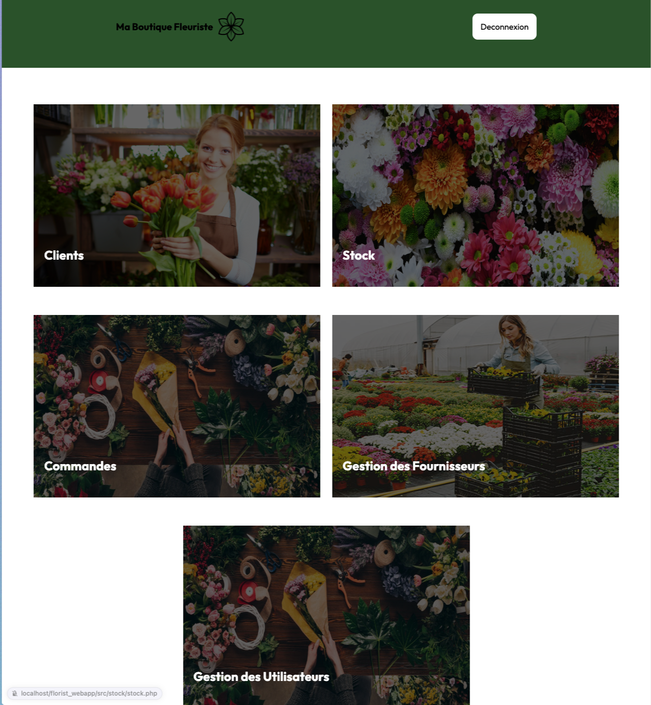

# Florist Dashboard

This project was developed as part of a school assignment. The goal was to create A dashboard for a florist with customer management, order tracking, flower stock management, etc.

  
  
  

## Features

- Customer management with personal information.
- List of orders with details.
- Flower stock management by varieties, colors, and prices.
- Complete list of orders.
- List of suppliers.

## Technologies Used

- PHP
- MySQL
- CSS

## Prerequisites

- PHP server
- MySQL database

## License

This project is licensed under the [MIT License](LICENSE) - see the LICENSE file for more details.
